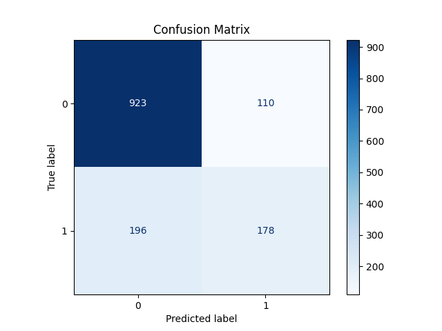

# customer-churn-ml-pipeline
An automated ML pipeline for customer churn prediction using the Telco dataset.
## **Project Overview**
- Predict whether a customer will churn (leave the service).
- Kaggle's Telco Customer Churn dataset.
- Automated pipeline built in **Python**.
- Production-style, reproducible, modular code.

---

## **Features**
- Data ingestion from raw Excel/CSV
- Cleaning & processing
- Feature engineering (encoding, scaling)
- Train/test split
- Model training (RandomForestClassifier)
- Model evaluation (accuracy, classification report)
- Model saving for deployment

---
## **Data Source**
- Kaggle: [Telco Customer Churn](https://www.kaggle.com/datasets/blastchar/telco-customer-churn)

---

## **Pipeline Steps**
1. **Data Ingestion**
   - Loads raw Excel/CSV data
   - Validates schema
   - Cleans and saves to `data/processed/`
   
2. **Preprocessing**
   - Loads cleaned data
   - Converts data types
   - Encodes categoricals
   - Scales numericals
   - Splits train/test
   - Saves to `data/features/`
   
3. **Model Training**
   - Loads features
   - Trains RandomForestClassifier
   - Evaluates on test set
   - Saves trained model to `models/`

---
## Results

The RandomForest model was trained with `class_weight='balanced'` to address class imbalance.

**Test set metrics:**

| Class        | Precision | Recall | F1-score | Support |
|--------------|-----------|--------|----------|---------|
| No Churn (0) | 0.82      | 0.89   | 0.86     | 1033    |
| Churn (1)    | 0.62      | 0.48   | 0.54     | 374     |

**Overall Accuracy:** 78.2%

**Macro Average:**
- Precision: 0.72
- Recall: 0.68
- F1-score: 0.70

**Weighted Average:**
- Precision: 0.77
- Recall: 0.78
- F1-score: 0.77
---
## 📊 Confusion Matrix

